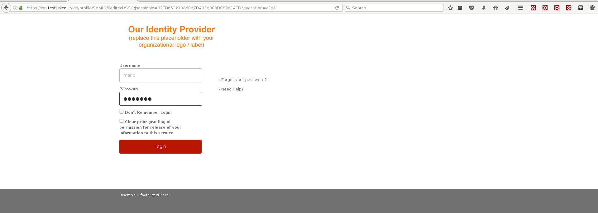

[NotUsableYET][Ansible playbook] Shibboleth Debian 9 
======================================

Setup in locale di ShibbolethIdP 3 e Shibboleth SP 2.
Richiede una installazione di OpenLDAP, così come illustrata al seguente url:

````
https://github.com/peppelinux/ansible-slapd-eduperson2016
````

I servizi configurati in questo playbook sono:

- tomcat8
- apache2
- mod_shib2 (Service provider)
- shibboleth (Identity provider)
- mariaDB

Requisiti
---------

- Installare OpenLDAP separatamente, eventualmente con il seguente playbook: https://github.com/peppelinux/ansible-slapd-eduperson2016
- Creare e utilizzare due interfacce di rete, rispettivamente per IDP e SP
- Installare le seguenti dipendenze per l'esecuzione in locale di ansible

````    
aptitude install python3-pip python-dev libffi-dev libssl-dev libxml2-dev libxslt1-dev libjpeg-dev zlib1g-dev
pip3 install ansible
````

Comandi di deployment e cleanup
===============================

Puoi creare delle chiavi firmate di esempio con make_ca.sh.
Edita le variabili nel playbook e il file hosts prima di fare l'esecuzione.
Il seguente esempio considera una esecuzione in locale.

````
    ansible-playbook -i "localhost," -c local playbook.yml -vvv
````

Se cambi parametri puoi fare un cleanup. 
Questo è altamente sconsigliato in ambienti di produzione perchè disinstalla i software e rimuove brutalmente il contenuto delle directory di configurazione.

````
    ansible-playbook -i "localhost," -c local playbook.yml -vvv -e '{ cleanup: true }'
````


Risultato
========================





Note
========================

La VM bisogna che abbia almeno due interfacce di rete, una per l'idp e un'altra per l'sp. Puoi usare configurazioni Vagrant oppure configurarne una manualmente in virtualbox.

Crea nel tuo DNS o in /etc/hosts gli hostname idp ed sp se sei in testunical

    10.0.3.22  idp.testunical.it
    10.0.4.22  sp.testunical.it

Gli utenti creati in slapd sono definiti in
    
    roles/slapd/templates/direcory-content.ldif

E' necessario configurare gli hostname in /etc/hosts o utilizzare un nameserver dedicato per accedere al servizio HTTPS
    
    https://sp.testunical.it

Miglioramenti
========================

Velocizzare avvio/riavvio Tomcat8, fonte: https://wiki.idem.garrservices.it/wiki/index.php/IDEM:Guide, pagina 12, capitolo 9.
  
Copiare l'output di
    
    ls /opt/shibboleth-idp/webapp/WEB-INF/lib | awk '{print $1",\\"}'
  
a seguito di
    
    tomcat.util.scan.StandardJarScanFilter.jarsToSkip=\
      
all'interno del file 
    
    /etc/tomcat8/catalina.properties

Disabilitare SAML 1 (stessa fonte del precedente) - questo e le seguenti indicazioni di Marco Malavolti sono state implementate nel playbook con il commit del "27 Apr 2017"
    
    sed -i 's/<IDPSSODescriptor protocolSupportEnumeration="urn:oasis:names:tc:SAML:2.0:protocol urn:oasis:names:tc:SAML:1.1:protocol urn:mace:shibboleth:1.0">/<IDPSSODescriptor protocolSupportEnumeration="urn:oasis:names:tc:SAML:2.0:protocol">/' /opt/shibboleth-idp/metadata/idp-metadata.xml 
    sed -i 's|<ArtifactResolutionService Binding="urn:oasis:names:tc:SAML:1.0:bindings:SOAP-binding" Location="https://idp.testunical.it:8443/idp/profile/SAML1/SOAP/ArtifactResolution" index="1"/>||' /opt/shibboleth-idp/metadata/idp-metadata.xml 
    sed -i 's|/idp/profile/SAML2/SOAP/ArtifactResolution" index="2"|/idp/profile/SAML2/SOAP/ArtifactResolution" index="1"|' /opt/shibboleth-idp/metadata/idp-metadata.xml

	
Ringraziamenti
========================

Ispirato da Garr Netvolution 2017 (http://eventi.garr.it/it/ws17) e basato sul lavoro di Davide Vaghetti https://github.com/daserzw/IdP3-ansible.

Un ringraziamento speciale a Marco Malavolti per la redazione delle guide di installazione ufficiali e per le repository (https://github.com/malavolti).

Troubleshooting
========================

opensaml::FatalProfileException
    Error from identity provider: 
    Status: urn:oasis:names:tc:SAML:2.0:status:Responder
    probabilmente manca la chiave pubblica dell'SP presso l'IDP, oppure le chiavi presentano, localmente, permessi di 
    lettura errati. L'IDP preleva il certificato dall'SP tramite MetaDati. Se questo errore si presenta e i certificati sono     stati adeguatamente definiti in shibboleth2.xml... Hai ricordato di riavviare shibd? :)

"Request failed: <urlopen error ('_ssl.c:565: The handshake operation timed out',)>"

    TASK [mod-shib2 : Add IdP Metadata to Shibboleth SP]
    libapache2-mod-shib2 non contiene i file di configurazione in /etc/shibboleth (stranezza apparsa su una jessie 8.0 aggiornata a 8.7). 
    Verificare la presenza di questi altrimenti ripopolare la directory

Test confgurazioni singoli servizi/demoni

    xmlwf -e UTF-8 /etc/tomcat8/$nomefile.xml
    apache2ctl configtest
    shibd -t
    

opensaml::SecurityPolicyException
Message was signed, but signature could not be verified.
L'SP ha i metadati dell'IDP errati/disallineati.
		
	cd /etc/shibboleth/metadata
	wget --no-check-certificate https://idp.testunical.it/idp/shibboleth
	# verificare che siano effettivamente differenti !
	diff shibboleth idp.testunical.it-metadata.xml 
	rm idp.testunical.it-metadata.xml 
	mv shibboleth idp.testunical.it-metadata.xml 
	# nessun riavvio è richiesto

Altri comandi
========================

Esecuzione di un solo role
    
    ansible-playbook playbook.yml -i hosts --tag common

Esecuzione selettiva, quei roles limitati ai nodi idp
    
    ansible-playbook playbook.yml -i hosts -v --tag tomcat7,slapd --limit idp
    
Esecuzione selettiva, quei roles limitati a quel target

    ansible-playbook playbook.yml -i hosts -v --tag tomcat7,slapd --extra-vars "target=idp"

Setup di Shibboleth Idp3
    
    ansible-playbook playbook.yml -i hosts -v --tag shib3idp --limit idp 

Todo
====

- Implementare multiple sources per attributi da RDBMS differenti
- ruolo per SP con nginx
